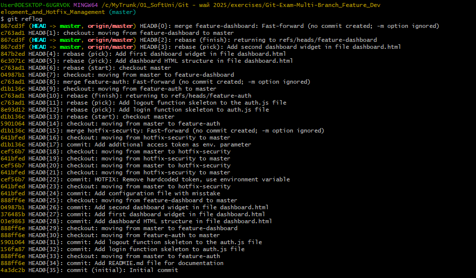
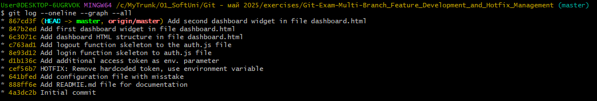
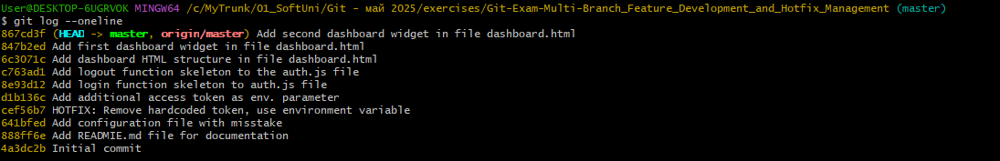

# Git Multi-Branch Demo

## Git Reflog


## git graph


## Git log


# Documentation of the used commands using to solve the task

```bash
git init
echo "console.log('Main app');" > app.js
git add .
git commit -m"Initial commit"
echo "# Git Multi-Branch Demo" > README.md
git status
git add .
git commit -m"Add READMIE.md file for documentation"
git checkout -b feature-auth
echo "function login() { /* TODO */ }" > auth.js
git status
git add .
git commit -m "Add login function skeleton to auth.js file"
echo "function logout() { /* TODO */ }" >> auth.js
git add auth.js
git commit -m "Add logout function skeleton to the auth.js file"
git checkout master
git checkout -b feature-dashboard
echo "Dashboard HTML structure" > dashboard.html
git add .
git commit -m "Add dashboard HTML structure in file dashboard.html"
echo "<div class='widget'>Widget 1</div>" >> dashboard.html
git add dashboard.html
git commit -m "Add first dashboard widget in file dashboard.html"
echo "<div class='widget'>Widget 2</div>" >> dashboard.html
git add .
git commit -m "Add second dashboard widget in file dashboard.html"
git checkout master
echo "var userToken = 'hardcoded-token-123';" > config.js
git status
git add .
git commit -m "Add configuration file with misstake"
git checkout -b hotfix-security
echo "var userToken = process.env.USER_TOKEN || '';" > config.js
git add config.js
git commit -m "HOTFIX: Remove hardcoded token, use environment variable"
git rebase master
git status
git checkout master
git checkout hotfix-security
git rebase master
git checkout master
git checkout hotfix-security
echo "var userAccessToken = process.env.USER_ACCESS_TOKEN || '';" >> config.js
git add .
git commit -m"Add additional access token as env. parameter"
git rebase master
git checkout master
git status
git merge hotfix-security -m "Merge hotfix-security: Fix critical security vulnerability"
git checkout feature-auth
git rebase master
git checkout master
git merge feature-auth -m "Merge feature-auth: Add authentication system"
git checkout feature-dashboard
git rebase master
git checkout master
git merge feature-dashboard -m "Merge feature-dashboard: Add UI dashboard"
git branch -d feature-auth
git branch -d feature-dashboard
git branch -d hotfix-security
git status
git log --oneline --graph --all
git reflog
git remote add origin https://github.com/ninovvas/Git-Exam-01_Multi-Branch_Feature_Development_and_Hotfix_Management.git
git push -u origin master
```
